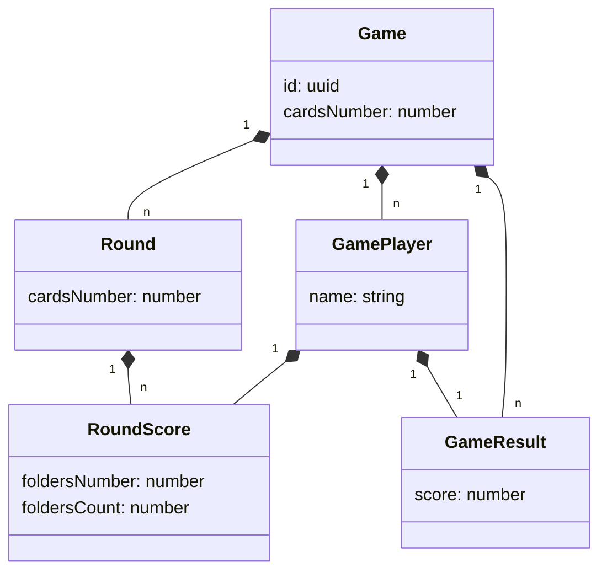

# Wizard Scoreboard
A score board for the wizard card game

## Rules

* Distribute 1 card to each player
* Each player must tell how many folds he hopes to do
* The total of folds can't be equal to the number of cards distributed to one player (i.e. 1)
* Round is played
* At the end of the round, scores are computed
    * if a player reach the number of folds he announced, he won 20 points + 10 x the number of holds he's done
    * if a player didn't reach the number of folds he announced or he gets more, he lost 10 x the difference between hes score and the number he announced
* Next round begin with 2 cards for eache players...

## Conception

### Model

